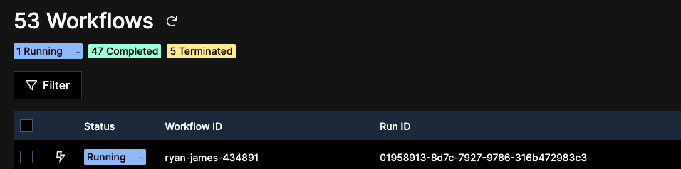

# temporal-trip-booking-demo
To run the demo, run the following commands:

1. In Terminal 1: ```start temporal server```
2. In Terminal 2: ```uv run run_worker.py```
3. In Terminal 3: ```uv run starter.py```

_Side note_ - rember to setup your python venv in each terminal

## Start Temportal server
In Terminal 1
```bash
temporal server start-dev --db-filename trip-booker.db
```

## Run worker
In Terminal 2
```bash
uv venv
source .venv/bin/activate
uv run run_worker.py
```

Access Temporal Server at - http://localhost:8233/namespaces/default/workflows

## Run Flask Web application and temportal client
In Terminal 3
```bash
uv venv
source .venv/bin/activate
uv run starter.py
```

Access the web app and temporal client by navigating to http://127.0.0.1:5050


**Create a human task flow**
To create human task flow - create a booking where the hotel booking number starts with the string "manual".


This will show a running task waiting for some human approval


Now the approvals can be viewed and approved/rejected from the web console (there was a client created for this)


After approval


# TO-DO or to be fixed
1. Polling event history for the task workflow prints or displays every polling interval


2. The approval client app is using a CLI command in the web interface to approve or reject the task workflow. This must be changed to use the temporal client library.